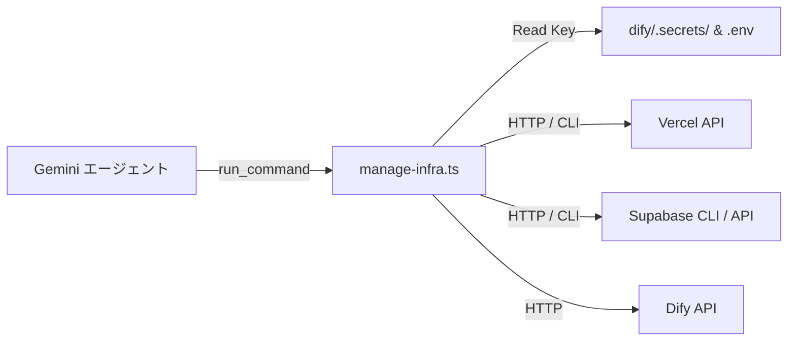
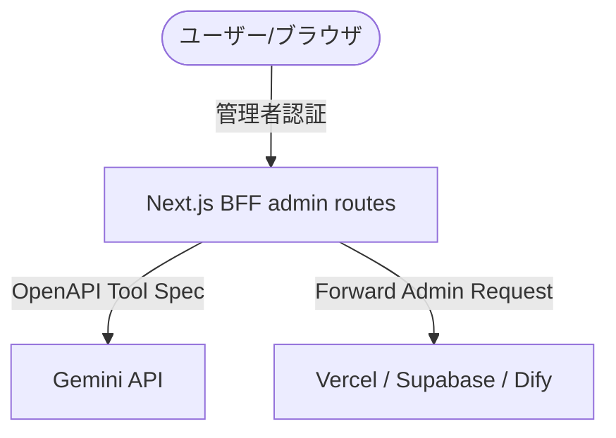
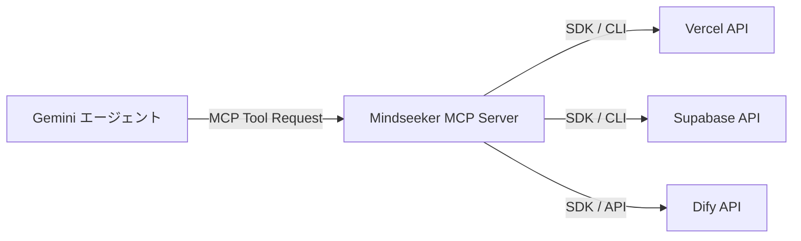

# インフラ管理 API 選定および Gemini 連携設計書

本書は、Mindseeker が依存する3つのインフラプラットフォーム（Supabase、Dify、Vercel）について、外部からプログラム的に管理操作を行うための **APIの選定**、および **Gemini（LLMエージェント）から直接これらのインフラを操作・管理できるようにするための統合メカニズム** を設計・提案する文書です。

---

## 1. 各インフラの管理 API 選定

Gemini などの AI アシスタントが、対話を通じてシステムのデプロイ、プロンプト変更、環境変数の操作などを行うために利用可能な API 群をピックアップします。

### 1.1. Vercel API
Vercel でホストされているフロントエンド・BFF のデプロイや環境変数を制御するための API です。

* **認証**: `Bearer <VERCEL_PERSONAL_ACCESS_TOKEN>`
* **主要エンドポイント**:
  * **環境変数の操作**:
    * `GET /v9/projects/{idOrName}/env`（一覧取得）
    * `POST /v10/projects/{idOrName}/env`（環境変数の追加。DifyのAPIキーやSupabaseのキーのローテーションに有効）
    * `PATCH /v9/projects/{idOrName}/env/{id}`（環境変数の更新）
  * **デプロイのトリガー**:
    * `POST /v13/deployments`（指定したGitコミットやローカルファイルから新規デプロイを実行）
  * **デプロイ状況の監視**:
    * `GET /v6/deployments/{id}`（デプロイの進捗・成否ステータスを確認）

### 1.2. Dify Management / Utility API
Dify に構築された AI チャットアプリケーションの設定や、ナレッジベース、モデルパラメータを管理するための API です。

* **認証**: `Bearer <DIFY_APP_API_KEY>` または管理者用の `Personal Access Token`
* **主要エンドポイント / アクション**:
  * **アプリケーション設定パラメータの取得**:
    * `GET /v1/parameters`（オープニングメッセージや提示質問など、アプリ基本設定の読み込み）
  * **会話・メッセージ履歴管理**:
    * `GET /v1/messages` (会話履歴データの検査)
    * `DELETE /v1/conversations/{id}` (スレッドクレンジング)
  * **Dify Application の設定・プロンプト同期 (※Dify self-hosted または管理者API利用時)**:
    * DSL (YAML) のエクスポート・インポート機能を利用し、開発中のプロンプト（`dify/プロンプト.md` 等）を API 経由で Dify 側にアップロードして最新化。

### 1.3. Supabase CLI & Edge API
Supabase のサーバーレス関数（Edge Functions）や、データベースマイグレーションの状況、ユーザー管理を行うための API です。

* **認証**: `Bearer <SUPABASE_PERSONAL_ACCESS_TOKEN>` または `X-Client-Info` / `service_role`
* **主要エンドポイント**:
  * **Edge Functions 管理**:
    * `GET /v1/projects/{ref}/functions`（関数一覧の取得）
    * `POST /v1/projects/{ref}/functions`（新規 Edge Function のデプロイ）
    * `PATCH /v1/projects/{ref}/functions/{slug}`（関数の更新。`planning-api` 等のデプロイ自動化に使用）
  * **データベーススキーマ & マイグレーション状況の取得**:
    * Supabase の管理用 SQL API（`POST /v1/projects/{ref}/db/query`）を叩き、現在のマイグレーションの適用状態やテーブル定義を動的に読み取らせる。

---

## 2. Gemini から管理するための連携メカニズム設計

これらの管理 API を、Gemini（開発時の AI エージェント、または本番アプリ内の AI アシスタント）から安全かつ直感的に操作させるための仕組みとして、以下の3つのアプローチを設計します。

### 2.1. 【アプローチ A】ローカル管理 CLI + `run_command`（AI開発エージェント向け・推奨）
開発時に、Antigravity などの AI コーディングエージェントが開発環境からインフラを直接操作・更新できるようにするための仕組みです。

* **仕組み**:
  * `tools/infra/` ディレクトリ配下に、各 API をラッピングした Node.js/TypeScript スクリプト（例: `manage-vercel.ts`, `manage-dify.ts`）を配置。
  * エージェントは `run_command`（`npx tsx tools/infra/manage-vercel.ts add-env DIFY_API_KEY ...` 等）を呼び出してインフラを操作。
* **メリット**:
  * BFF側に管理用 API を公開しなくてよいため、**本番環境のセキュリティリスクが極めて低い**。
  * デプロイやマイグレーションといった「開発寄り」のタスクと親和性が高い。
* **セキュリティ**:
  * 各種管理トークン（Vercel Access Token, Supabase Access Token）は、ローカルの `.env` もしくは `.secrets/` にのみ保存し、Git には含めない。

---

### 2.2. 【アプローチ B】BFF 管理エンドポイント + OpenAPI スキーマ（アプリ内 AI 向け）
Mindseeker の将来的な機能として、アプリケーションの画面上からユーザーが AI アシスタントに対し、「環境変数を変更して」「プロンプトを更新して」と指示して自己管理させる場合のアプローチです。

* **仕組み**:
  * BFF 側に `/api/admin/infra/env`, `/api/admin/infra/deploy`, `/api/admin/infra/dify` などのエンドポイントを構築。
  * これらの API の OpenAPI スキーマファイル（`docs/admin-api.openapi.yaml`）を用意。
  * アプリ内で Gemini を呼び出す際、この OpenAPI 定義を `Tools (Function Calling)` として Gemini に登録。Gemini が必要に応じてこれらのエンドポイントを呼び出し、BFF がそれを代行してインフラ API を叩く。
* **メリット**:
  * ユーザーの Web 画面から完全にハンズフリーでインフラ設定や AI のプロンプト更新、デプロイが完結する。
* **セキュリティ**:
  * BFF 側で強固な管理者制限をかける必要がある（JWT 内のユーザーIDが、環境変数 `ADMIN_USER_IDS` に指定された特定の管理者 ID と一致するかをチェック）。

---

### 2.3. 【アプローチ C】MCP (Model Context Protocol) サーバーの構築（エージェント連携標準）
AI エージェントがツール（データベース、API、ファイルシステム）と対話するための業界標準規格である MCP を使用するアプローチです。

* **仕組み**:
  * `@modelcontextprotocol/sdk` を使用して、Node.js ベースの MCP サーバーをプロジェクト内（例えば `tools/mcp-server/`）に構築。
  * `vercel_deploy`, `vercel_set_env`, `supabase_deploy_function`, `dify_sync_prompt` などのツールを MCP 経由で登録。
  * Gemini エージェントはクライアントとしてこの MCP サーバーに接続し、標準的なプロトコルに則ってインフラ操作をツールとして呼び出す。
* **メリット**:
  * 拡張性が極めて高い。VS Code などのエディタに組み込まれた他の AI エージェントでも、一切の書き換えなしに同じインフラ管理機能を利用できる。

---

## 3. 実装の方向性の選択

1. **短期的な開発効率化 (Antigravity エージェントによる操作)**:
   まずは **【アプローチ A (ローカル管理 CLI)】** を構築し、Antigravity（AIエージェント）が「マイグレーションを走らせて」「Edge Functions をデプロイして」といったユーザーの指示をシェルコマンド経由で処理できるようにするのが最も容易かつ効果的です。
2. **中長期的なシステム自律運用 (アプリ画面からの制御)**:
   **【アプローチ B】** を進め、Next.js BFF に管理者向けのエンドポイントを追加し、Dify エージェントまたは Gemini 連携モジュールにその OpenAPI を食わせることで、AI による自動システム最適化（プロンプト自動学習・自動更新や自動環境変数ローテーション）が可能になります。
