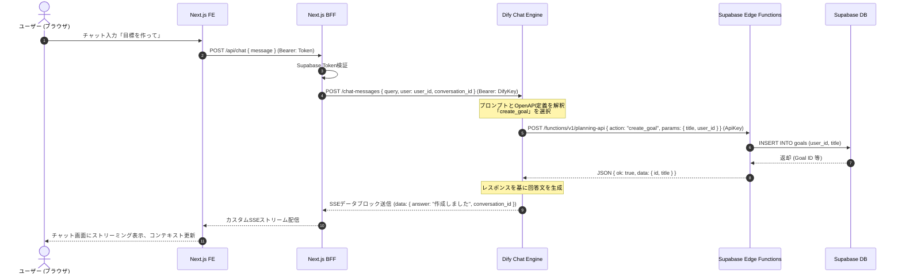
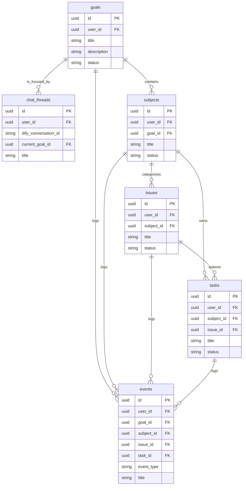

# Mindseeker システムアーキテクチャ・設計仕様書

本書は、Supabase、Dify、Vercel (Next.js) を統合して構築された「AI駆動型ゴール・タスク管理アプリケーション」である **Mindseeker** のシステム構成、コンポーネントの役割、主要なデータフロー、およびデータベース設計をまとめた仕様・設計文書です。

---

## 1. システム全体構成

Mindseeker は、ユーザーが AI チャットを通じてゴール（目標）やそれに紐づくサブジェクト、課題、タスクを設計・管理できるシステムです。以下の3つのコアプラットフォームが密に連携しています。

* **フロントエンド & BFF (Next.js / Vercel)**:
  * ユーザーが操作するUI画面（チャット画面、ゴール管理画面）の提供。
  * 安全な中継局（BFF）として、外部プラットフォーム (Dify, Supabase) との連携 API を実装。
* **AI エージェントプラットフォーム (Dify)**:
  * チャット対話のバックエンド。ユーザーの発言の意図（セマンティクス）を解釈。
  * データベースの更新が必要な場合、OpenAPI で定義された「ツール（アクション）」を介して Supabase バックエンドを呼び出す。
* **バックエンド & データベース (Supabase)**:
  * **Supabase Auth**: JWT を利用した安全なユーザー認証。
  * **PostgreSQL**: ゴールやタスク、チャットスレッドなどの永続化層。Row Level Security (RLS) によるマルチテナント保護。
  * **Edge Functions**: Dify エージェントから API キー認証を伴う Webhook / Tool アクションを受け付け、データベースを操作する単一エントリポイント（API ルーター）。

### 連携ブロック図
```mermaid
graph TD
    User([ユーザー/ブラウザ]) <-->|HTTPS / SSE| NextFE[Next.js FE (Vercel)]
    NextFE <-->|BFF API / Auth Token| NextBFF[Next.js BFF (Vercel)]
    NextBFF <-->|REST API (Bearer Token)| Dify[Dify Chat Agent]
    Dify <-->|OpenAPI Tool Call| EdgeFunc[Supabase Edge Functions]
    EdgeFunc <-->|SQL / Service Role| DB[(Supabase DB)]
    NextBFF <-->|client-side / server-side Auth| SupaAuth[Supabase Auth]
    NextBFF <-->|Read Data| DB
```

---

## 2. コンポーネント設計と役割分担

### 2.1. フロントエンド & BFF (Next.js)
* **認証ゲートウェイ**: `/login` にて Google/GitHub 認証を行い、`/auth/callback` を経由してセッションを確率。セッション情報はブラウザクッキーおよび Supabase クライアント側で保持。
* **BFF ルート (`/app/api/`)**:
  * すべての保護ルート（`/api/chat`, `/api/goals` など）は、ヘッダーの `Authorization: Bearer <supabase_access_token>` を検証し、認証済みユーザーのみ実行を許可します。
  * Dify の API 認証（`DIFY_API_KEY`）はサーバーサイドでのみ保持され、BFF が代理でリクエストを送信するため、認証キーが漏洩するリスクを防止します。
  * Dify からの SSE (Server-Sent Events) ストリームをパース・整理し、フロントエンドに統一された SSE 規格で再配信します。

### 2.2. Dify (AI Chat Agent)
* ユーザーとのチャットコンテキスト（会話履歴）を保持します。
* プロンプト定義に基づいて、ユーザーのメッセージが「目標の作成」「タスクの追加」「進捗の要約」などにあたるかを識別し、登録された OpenAPI ツールを実行します。
* **Dify ツール仕様書**:
  * [dify/planning-api.openapi.yaml](file:///d:/onedrive/★AI/Mindseeker/dify/planning-api.openapi.yaml): ゴール/タスクの CRUD 操作。
  * [dify/context-api.openapi.yaml](file:///d:/onedrive/★AI/Mindseeker/dify/context-api.openapi.yaml): 現在の会話のフォーカス対象ゴール（`current_goal_id`）の紐付け。

### 2.3. Supabase
* **Edge Functions (`planning-api`, `context-api`)**:
  * Dify からの API 呼び出しを受け取るサーバーレス関数（Deno 環境）。
  * 認証ヘッダー `X-Planning-Api-Key` にて安全な接続を担保。
  * `SUPABASE_SERVICE_ROLE_KEY` を使用してアクセスするため、RLS ポリシーをバイパスして、要求された `user_id` に対する各種書き込み・編集処理を代行します。
* **RLSポリシー (Row Level Security)**:
  * ユーザー自身のデータ（`user_id = auth.uid()`）のみに直接 `SELECT`/`INSERT`/`UPDATE` ができるようデータベース層で堅牢に保護。

---

## 3. 主要なデータフロー

### 3.1. チャット対話とツール（アクション）実行フロー

ユーザーが「目標を作成して」と入力してから、実際にデータベースが更新され、回答が返ってくるまでの処理シーケンスです。



---

## 4. データベース設計 (主要テーブル)

すべての主要プランニングオブジェクトは、`user_id` によるテナントスコープを伴い、UUID 形式で相互にリレーションを持っています。

### 4.1. テーブル一覧と親子リレーション
* **`chat_threads`**: 会話スレッドの管理。Dify 側の `conversation_id` と現在のフォーカス目標である `current_goal_id` を保持。
* **`goals` (目標)**: 最上位オブジェクト（例: 「英会話を習得する」）。
* **`subjects` (サブジェクト)**: 目標の下位カテゴリ・領域（例: 「リスニング」「文法」）。`goal_id` を親に持つ。
* **`issues` (課題/論点)**: 解決すべき問題（例: 「シャドーイングで音が聴き取れない」）。`subject_id` を親に持つ。
* **`tasks` (タスク)**: 具体的なアクション（例: 「毎日15分CNNを聴く」）。`subject_id`（必須）および `issue_id`（任意）を親に持つ。
* **`events` (履歴/出来事)**: アクションのログ（例: 「Difyとの会話でリスニングを強化する方針とした」）。各オブジェクトの ID を任意で関連付け。
* **`application_logs`**: BFF / Edge Function でのエラーロギング。

### 4.2. データベース ER ダイアグラム

