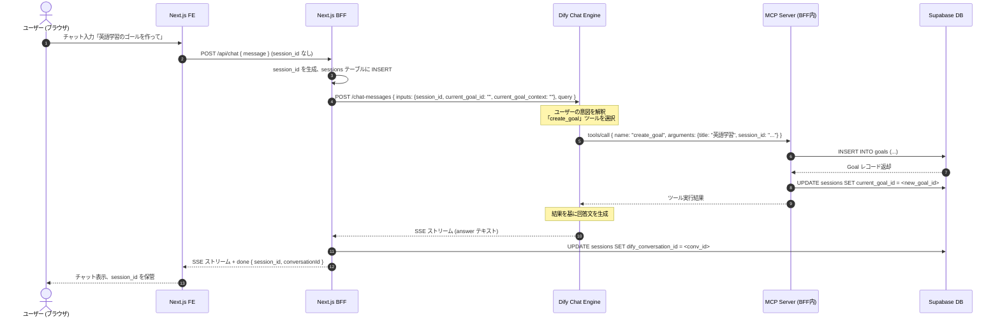
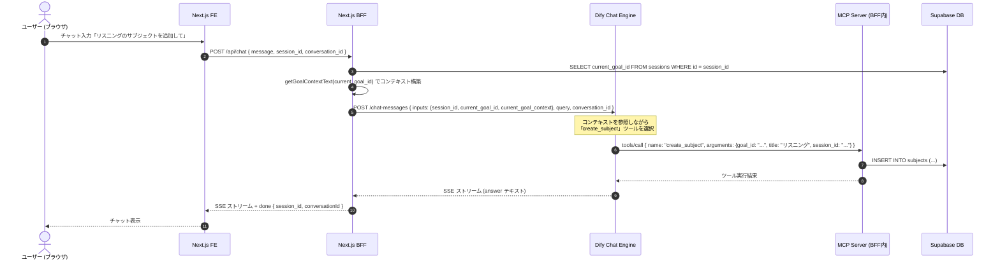

# Session-Based Context Injection & MCP Direct Execution Flow

Updated: 2026-06-18

このドキュメントは、Next.js BFF と Dify 間で行われる「セッションベースのコンテキスト動的送信」と「DifyがMCPサーバ経由で直接データベースを更新する」仕組みについて解説します。

> 本方式は [dify-context-and-json-orchestration.md](./dify-context-and-json-orchestration.md) に記載された旧方式（JSON Orchestration）を置き換えるものです。

---

## 1. 概要

従来の方式では、Dify が回答末尾に JSON ブロックを出力し、BFF がそれを解釈して DB を更新していました。新方式では以下に変更します：

- **Dify が MCP サーバの tool call で直接 DB を更新する**（BFF 側の orchestrator は不要に）
- **`sessions` テーブルでコンテキスト状態を管理する**（`chat_threads.current_goal_id` を廃止）
- **`session_id` を FE ↔ BFF ↔ Dify 間で受け渡す**ことで、状態の一貫性を担保する

---

## 2. sessions テーブル

```sql
CREATE TABLE IF NOT EXISTS public.sessions (
  id uuid PRIMARY KEY DEFAULT gen_random_uuid(),
  user_id uuid NOT NULL REFERENCES auth.users(id) ON DELETE CASCADE,
  current_goal_id uuid REFERENCES public.goals(id) ON DELETE SET NULL,
  dify_conversation_id text,
  created_at timestamptz NOT NULL DEFAULT now(),
  updated_at timestamptz NOT NULL DEFAULT now()
);
```

| カラム | 説明 |
|--------|------|
| `id` | セッションID。BFF が初回チャット時に生成し、以降のやりとりで使い回す |
| `user_id` | ユーザーID |
| `current_goal_id` | 現在フォーカスしているゴールの ID。MCP ツール実行時に自動更新される |
| `dify_conversation_id` | Dify 側の conversation_id。初回レスポンスで判明した後に書き込む |

---

## 3. コンテキストの動的送信 (Context Injection)

### 処理フロー

1. **チャット送信受付**: FE から `/api/chat` に `message`, `conversation_id`, `session_id` が送られる。
2. **セッション解決**:
   - `session_id` が無い（初回）: BFF が新しい `session_id` を生成し、`sessions` テーブルに INSERT する。
   - `session_id` がある（2回目以降）: `sessions` テーブルから `current_goal_id` を取得する。
3. **コンテキスト文字列の生成**: `current_goal_id` が存在する場合、`lib/mcp/handlers.ts` の `getGoalContextText()` を用いてコンテキスト文字列を組み立てる。
4. **Dify への送信**: Dify の `POST /chat-messages` API を呼ぶ際、`inputs` に以下を含める：
   ```json
   {
     "inputs": {
       "session_id": "<UUID>",
       "current_goal_id": "<ID or empty>",
       "current_goal_context": "<組み立てられたコンテキスト文字列>"
     },
     "query": "<ユーザーのメッセージ>",
     ...
   }
   ```
5. **レスポンス返却**: BFF は SSE ストリームの `done` イベントに `session_id` を含めて FE に返す。

### FE 側の処理

- 初回チャット送信時: `session_id` は送らない（または空文字）
- BFF レスポンスの `done` イベントから `session_id` を取得して state に保管
- 2回目以降のチャット送信時: 保管した `session_id` をリクエストに含める
- 新規スレッド作成時: `session_id` をリセット（新しいセッションを開始）

---

## 4. MCP Direct Execution（MCP 直接実行）

従来の JSON Orchestration に代わり、Dify が MCP サーバの tool call で直接データベースを操作します。

### 処理フロー

1. **Dify 側のツール定義**: Dify には MCP サーバのツール（`create_goal`, `create_task` など）が登録されている。
2. **ツール呼び出し**: Dify エージェントがユーザーの意図を解釈し、必要なツールを呼び出す。この際、Dify は `session_id` をパラメータとして渡す。
3. **MCP サーバでの処理** (`/api/mcp/[profile]`):
   - ツールを実行して DB を更新する（従来通り）
   - `session_id` が渡されている場合、`sessions` テーブルの `current_goal_id` を自動更新する
     - `create_goal` → 新しいゴールの ID をセット
     - `update_goal`, `get_goal` → 操作対象のゴールの ID をセット
4. **BFF は仲介不要**: Dify → MCP サーバ → DB の経路で直接更新されるため、BFF でのストリーム後処理（orchestrator）は不要。

### session_id による自動 current_goal_id 更新ロジック

```
MCP tool call with session_id parameter:
  ├─ create_goal  → sessions.current_goal_id = 新規ゴールID
  ├─ update_goal  → sessions.current_goal_id = 対象ゴールID
  ├─ get_goal     → sessions.current_goal_id = 対象ゴールID
  ├─ complete_goal → sessions.current_goal_id = NULL (ゴール完了)
  └─ その他       → current_goal_id は変更しない
```

---

## 5. シーケンス図

### 初回チャット（新規セッション）



### 2回目以降のチャット（既存セッション）



---

## 6. アーキテクチャ上の利点

### 旧方式 (JSON Orchestration) との比較

| 観点 | 旧方式 | 新方式 (Session + MCP) |
|------|--------|------------------------|
| DB更新タイミング | ストリーム完了後にBFFが一括実行 | Dify のツール呼び出し時に即座に実行 |
| エラーハンドリング | BFF側で全opを管理（途中失敗のリカバリが複雑） | 各ツール呼び出し単位で Dify が結果を受け取り判断可能 |
| Dify の自律性 | JSON出力を「信じる」しかない | ツールの実行結果を見て次のアクションを決定可能 |
| コンテキスト管理 | chat_threads.current_goal_id | sessions テーブル（MCP が自動更新） |
| FE の複雑さ | 変わらない | session_id の保持が追加されるが軽微 |
| BFF の複雑さ | orchestrator のパース・実行ロジックが必要 | session 解決のみ（大幅に簡素化） |

### 主要な改善点

1. **リアルタイム性**: ゴール作成がストリーム完了を待たずに即座に反映される
2. **信頼性**: Dify がツール実行結果を確認できるため、失敗時のリトライや代替アクションが可能
3. **保守性**: BFF 側の複雑な JSON パース・プレースホルダー解決ロジック（orchestrator.ts）が不要に
4. **拡張性**: 新しいツールの追加が MCP ハンドラへの登録のみで完結

---

## 7. 関連ファイル

| ファイル | 役割 |
|----------|------|
| `app/api/chat/route.ts` | BFF チャットエンドポイント。session 解決とコンテキスト送信 |
| `app/api/mcp/[profile]/route.ts` | MCP サーバエンドポイント。Dify からの tool call を処理 |
| `lib/mcp/handlers.ts` | ツール実装 + session 自動更新ロジック |
| `lib/mcp/tools.ts` | ツール定義（inputSchema） |
| `lib/mcp/profiles.ts` | プロファイル別ツールアクセス制御 |
| `lib/db/sessions.ts` | sessions テーブルの CRUD ヘルパー（新規作成） |
| `components/features/workspace/unified-workspace.tsx` | FE チャット UI（session_id 管理） |
