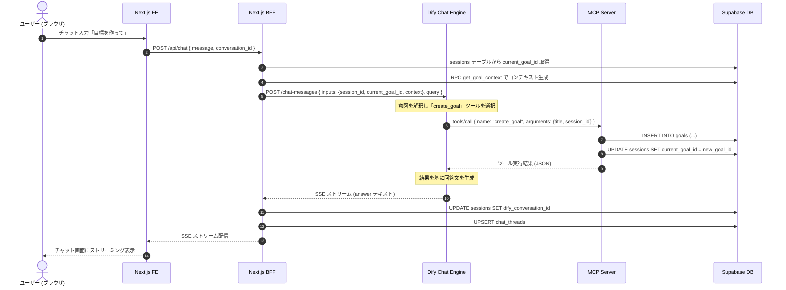
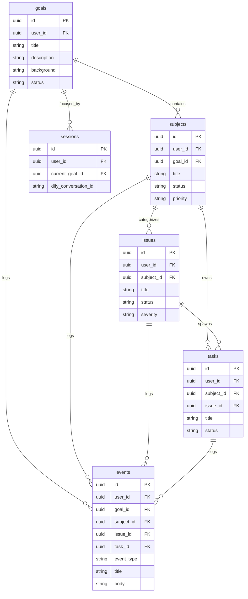

# Mindseeker システムアーキテクチャ

Updated: 2026-06-20

## 1. システム全体構成

Mindseeker は、ユーザーが AI チャットを通じてゴールやタスクを設計・管理できるシステムです。

### コアプラットフォーム

| 層 | 技術 | 役割 |
|----|------|------|
| フロントエンド & BFF | Next.js 15 (Vercel) | UI 提供、認証ゲートウェイ、Dify/DB 中継 |
| AI エージェント | Dify | チャット対話、意図解釈、MCP ツール呼び出し |
| MCP サーバー | Next.js API Route 内 | Dify からの tool call を受け、DB を操作 |
| データベース & 認証 | Supabase | PostgreSQL + RLS + Auth |

### 連携ブロック図

```mermaid
graph TD
    User([ユーザー/ブラウザ]) <-->|HTTPS / SSE| NextFE[Next.js FE (Vercel)]
    NextFE <-->|BFF API / Auth Token| NextBFF[Next.js BFF (Vercel)]
    NextBFF <-->|REST API (Bearer Token)| Dify[Dify Chat Agent]
    Dify <-->|MCP tool call (JSON-RPC)| MCP[MCP Server (Vercel)]
    MCP <-->|SQL / Service Role| DB[(Supabase DB)]
    NextBFF <-->|Supabase Auth| SupaAuth[Supabase Auth]
    NextBFF <-->|RPC / Read| DB
```

---

## 2. コンポーネント設計

### 2.1. フロントエンド & BFF (Next.js)

- **認証ゲートウェイ**: `/login` で Google/GitHub 認証 → `/auth/callback` でセッション確立
- **BFF ルート (`/app/api/`)**: すべての保護ルートは `Authorization: Bearer <supabase_access_token>` を検証
- **Dify 代理**: `DIFY_API_KEY` はサーバーサイドのみ保持。BFF が代理でリクエスト送信
- **SSE 中継**: Dify からのストリームをパースし、統一フォーマットで FE に再配信
- **Session 解決**: `conversation_id` から sessions テーブルを引き、コンテキストを構築して Dify に送信

### 2.2. Dify (AI Chat Agent)

- チャットコンテキスト（会話履歴）を保持
- BFF から受け取った `inputs`（`session_id`, `current_goal_id`, `current_goal_context`）を参照
- ユーザーの意図を解釈し、MCP サーバーのツールを呼び出してデータベースを直接操作
- ツール実行結果を確認した上で回答を生成

### 2.3. MCP サーバー

- Next.js API Route (`/api/mcp/[profile]`) として実装
- JSON-RPC 2.0 プロトコルで `tools/list` と `tools/call` を処理
- 独自 OAuth JWT で認証（`OAUTH_JWT_SECRET` で署名検証）
- プロファイル別アクセス制御（`dify-main`, `dify-sub`, `general`）
- ツール実行時に `session_id` があれば sessions テーブルの `current_goal_id` を自動更新

### 2.4. Supabase

- **Auth**: Google/GitHub OAuth プロバイダ。JWT を発行
- **PostgreSQL**: RLS により `user_id = auth.uid()` でマルチテナント保護
- **RPC 関数**: `get_goal_context`, `get_context_map`, `get_goal_detail` — 1クエリで関連データを一括取得
- **Service Role**: BFF と MCP サーバーが使用（RLS バイパスだが user_id 検証は必須）

---

## 3. 主要なデータフロー

### 3.1. チャット対話と MCP ツール実行フロー



### 3.2. セッションとコンテキスト管理

- **sessions テーブル**: BFF が Dify 呼び出し前に作成/参照。`current_goal_id` を保持
- **current_goal_id の更新**: MCP ツール実行時に自動（create_goal → 新ID、complete_goal → null）
- **コンテキスト注入**: BFF が sessions の `current_goal_id` から RPC でゴール情報を取得し、Dify の `inputs` に含める

---

## 4. データベース設計

すべてのテーブルは `user_id` によるテナントスコープを持ち、RLS で保護されています。

### 4.1. テーブル一覧

| テーブル | 説明 |
|---------|------|
| `goals` | 最上位目標（例: 「英会話を習得する」） |
| `subjects` | ゴール配下のカテゴリ・テーマ（例: 「リスニング」）。`goal_id` を親に持つ |
| `issues` | 解決すべき課題（例: 「音が聴き取れない」）。`subject_id` を親に持つ |
| `tasks` | 具体的アクション（例: 「毎日15分CNNを聴く」）。`subject_id` 必須、`issue_id` 任意 |
| `events` | 活動ログ（会話、判断、進捗）。各オブジェクト ID を任意で関連付け |
| `chat_threads` | Dify conversation の管理。`dify_conversation_id` を保持 |
| `sessions` | コンテキスト状態管理。`current_goal_id` と `dify_conversation_id` を保持 |
| `user_profiles` | ユーザー Tier（free / paid / contributor） |
| `chat_usage` | チャット利用回数の記録（Rate Limit 用） |
| `artifacts` | ゴールに紐づくドキュメント（Markdown） |
| `application_logs` | BFF / MCP のエラー・情報ログ |

### 4.2. ER ダイアグラム（プランニングオブジェクト）



---

## 5. パフォーマンス最適化

| 箇所 | 手法 |
|------|------|
| コンテキスト生成（送信前） | PostgreSQL RPC `get_goal_context` で1クエリ |
| コンテキストマップ取得（受信後） | PostgreSQL RPC `get_context_map` で1クエリ |
| ゴール詳細取得（受信後） | PostgreSQL RPC `get_goal_detail` で1クエリ |
| 受信後のリフレッシュ | `refreshContextMap` と `refreshGoalDetail` を `Promise.all` で並列実行 |

---

## 6. 関連ドキュメント

| ドキュメント | 内容 |
|------------|------|
| [session-based-context-injection.md](./session-based-context-injection.md) | Session 方式の詳細仕様 |
| [authentication.md](./authentication.md) | 認証・認可の仕様 |
| [user-tiers-and-rate-limits.md](./user-tiers-and-rate-limits.md) | ユーザー Tier と利用制限 |
| [open-issues.md](./open-issues.md) | 未解決の課題 |
