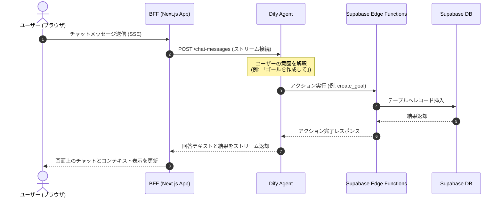

Listed directory Mindseeker
Viewed package.json:1-29
Listed directory app
Listed directory dify
Listed directory supabase
Listed directory tools
Listed directory lib
Listed directory api
Viewed BFF_DIFY_INTERFACE_SPEC.md:1-234
Viewed DIFY_TOOL_ACTION_SPEC.md:1-56
Viewed dify.ts:1-241
Viewed page.tsx:1-27
Listed directory chat
Viewed page.tsx:1-16
Listed directory components
Listed directory goals
Viewed page.tsx:1-22
Listed directory login
Listed directory auth
Listed directory supabase
Listed directory migrations
Viewed 20260606074209_add_user_id_and_rls.sql:1-156
Listed directory functions
Listed directory planning-api
Viewed README.md:1-62
Listed directory context-api
Viewed PARAMETERS.md:1-44
Viewed goals.ts:1-105
Viewed context-map.ts:1-122

カレントディレクトリのファイルを読み込み、プロジェクトの構造とシステムアーキテクチャの概要を理解しました。以下にまとめを報告します。

---

# Mindseeker プロジェクト概要

**Mindseeker** は、Next.js フロントエンド（BFF）、Supabase バックエンド、および Dify（AIエージェントプラットフォーム）を統合した、**AIによるゴール設計およびタスクプランニング管理アプリケーション**です。

## 1. 主要な技術スタック
- **フロントエンド / BFF**: Next.js 15 (App Router), React 19, TypeScript
- **データベース & 認証 & サーバーレス関数**: Supabase (Supabase Auth, SSR, Edge Functions)
- **AI エージェント**: Dify (Chat Messages API を使用したストリーミング対話)

---

## 2. ディレクトリ構造と主要ファイル

### 📁 フロントエンド / BFF (`app/`, `components/`, `lib/`)
* **[package.json](file:///d:/onedrive/★AI/Mindseeker/package.json)**: アプリケーションの依存関係や起動スクリプトの定義。
* **`app/` (Next.js App Router)**:
  * **[app/page.tsx](file:///d:/onedrive/★AI/Mindseeker/app/page.tsx)**: ルートページ。認証済みユーザーは `/chat` へリダイレクトされます。
  * **[app/chat/page.tsx](file:///d:/onedrive/★AI/Mindseeker/app/chat/page.tsx)**: チャット画面の親コンポーネント。
  * **[app/goals/page.tsx](file:///d:/onedrive/★AI/Mindseeker/app/goals/page.tsx)**: ゴール一覧・詳細画面の親コンポーネント。
  * **`app/api/`**: BFF として Dify API や Supabase と通信を行うエンドポイント。
* **`components/`**:
  * **[chat-workspace.tsx](file:///d:/onedrive/★AI/Mindseeker/components/chat-workspace.tsx)**: ストリーミングチャット、スレッド選択、コンテキスト情報などを制御する巨大なUIコンポーネント。
  * **[goals-workspace.tsx](file:///d:/onedrive/★AI/Mindseeker/components/goals-workspace.tsx)**: ゴール、サブジェクト、イシュー、タスク、イベントを階層的またはタイムライン形式で可視化・操作するUI。
* **`lib/`**:
  * **[lib/dify.ts](file:///d:/onedrive/★AI/Mindseeker/lib/dify.ts)**: Dify のチャットメッセージ送信、スレッド履歴取得、スレッド削除、パラメータ取得などの API 呼び出しヘルパー。
  * **[lib/goals.ts](file:///d:/onedrive/★AI/Mindseeker/lib/goals.ts)**: Supabase から指定したゴールと、それに関連するオブジェクト（サブジェクト、イシュー、タスク、イベント）をまとめて取得・作成するヘルパー。
  * **[lib/context-map.ts](file:///d:/onedrive/★AI/Mindseeker/lib/context-map.ts)**: チャット内で現在フォーカスしているゴールやコンテキスト情報のツリーを管理・提供する。

### 📁 Dify 連携仕様 (`dify/`)
* **[BFF_DIFY_INTERFACE_SPEC.md](file:///d:/onedrive/★AI/Mindseeker/dify/BFF_DIFY_INTERFACE_SPEC.md)**: BFF から Dify API へ送信する HTTP ペイロード、および Dify から返ってくる SSE ストリームの処理に関するトランスポート仕様。
* **[DIFY_TOOL_ACTION_SPEC.md](file:///d:/onedrive/★AI/Mindseeker/dify/DIFY_TOOL_ACTION_SPEC.md)**: Dify エージェントがツール（アクション）を選択した際に出力すべき仕様。
* **`planning-api.openapi.yaml` / `context-api.openapi.yaml`**: Dify がアクション選択時に使用する OpenAPI 規格書。

### 📁 バックエンド (`supabase/`)
* **`migrations/`**:
  * `goals`, `subjects`, `issues`, `tasks`, `events`, `chat_threads`, `application_logs` などのテーブルが定義されており、すべてのテーブルで Row Level Security (RLS) が適用され、ユーザーごとのデータが分離されています。
* **`functions/` (Supabase Edge Functions)**:
  * **`planning-api` ([planning-api/README.md](file:///d:/onedrive/★AI/Mindseeker/supabase/functions/planning-api/README.md))**:
    Dify エージェントや BFF からの共通エントリポイントとなる Edge Function。`create_goal`, `create_task`, `create_event` などのアクションに対応し、DBデータを直接書き換えます。
  * **`context-api` ([context-api/PARAMETERS.md](file:///d:/onedrive/★AI/Mindseeker/supabase/functions/context-api/PARAMETERS.md))**:
    チャット会話とゴールのフォーカス状況を同期させるための API（`set_current_goal` アクションなど）。

---

## 3. アプリケーションの基本データフロー

1. ユーザーがフロントエンドのチャット画面（[chat-workspace.tsx](file:///d:/onedrive/★AI/Mindseeker/components/chat-workspace.tsx)）から発言を送信。
2. フロントエンドは Next.js BFF を経由して Dify の `/chat-messages` API をストリーミング形式で呼び出す（[lib/dify.ts](file:///d:/onedrive/★AI/Mindseeker/lib/dify.ts)）。
3. Dify 側のエージェントはユーザーの発言にゴール作成やタスク変更の意図を認めると、登録された HTTP ツール経由で Supabase Edge Functions（`planning-api`, `context-api`）を呼び出す。
4. Edge Functions が Supabase DB を更新し、その結果が画面側に反映される。

現在、プロジェクトのベースとなる土台は完成しており、Dify と Supabase Edge Functions を用いた自律的かつインタラクティブなタスク/コンテキスト管理機能が実装されている状態です。